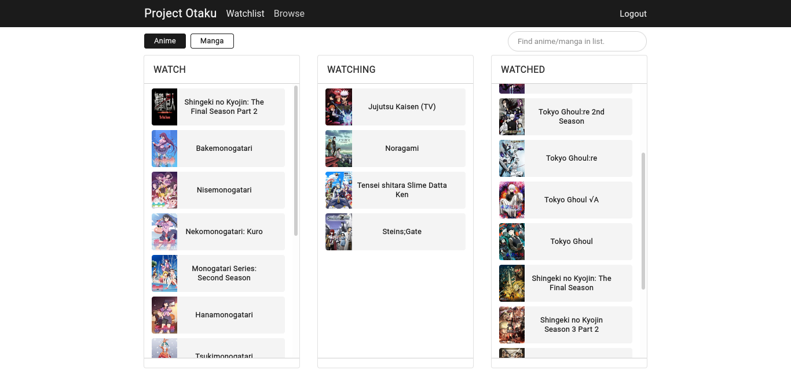

# Project Otaku

Project Otaku is a web app for creating and managing your anime and manga list.
It uses drag'n'drop system to manage your list.

## Goal

There are many applications out there like this project but I want something that I can
personalize. I also want to learn how to create web applications using Django with Djano REST
framework and ReactJS.

## Scope

- Backend REST API
    - Login/Register API
    - Anime list API (Create, Read, Update, Delete)
    - Manga list API (Create, Read, Update, Delete)

- Frontend SPA
    - Login/Register page
    - Anime list page
    - Manga list page
    - Search anime/manga in the list

## Additional Note

The project will use the unofficial [MyAnimeList](https://myanimelist.net/) API called
[Jikan](https://jikan.moe/) API as the main source of anime and manga database.
