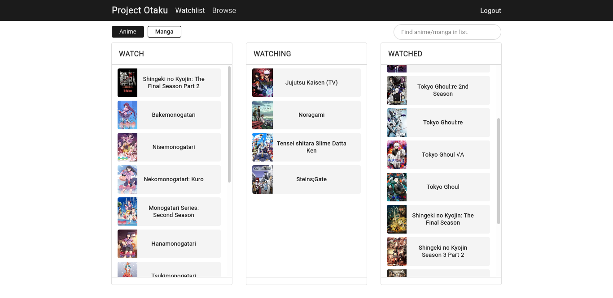

# Project Otaku

A web app for anime enthusiasts to manage their watch lists using a Kanban-style drag-and-drop board.



## Features

- **Kanban Board** — Organize anime into Watch, Watching, and Watched columns with drag-and-drop
- **Anime Search** — Search titles via the [Jikan API](https://jikan.moe/) (MyAnimeList data)
- **User Accounts** — JWT-based auth so your board persists across devices
- **Detail Links** — Click any card to open its MyAnimeList page
- **Mobile Responsive** — Collapses to a single-column accordion view on small screens
- **Caching** — Redis-backed search cache to stay within Jikan's rate limits

## Tech Stack

| Layer    | Technology              |
|----------|-------------------------|
| Frontend | React + Vite            |
| Backend  | FastAPI (Python)        |
| Database | PostgreSQL              |
| Cache    | Redis                   |

## Getting Started

### Prerequisites

- Docker & Docker Compose

### Setup

1. Clone the repo and copy the environment file:

   ```bash
   cp .env.example .env
   ```

2. Start all services:

   ```bash
   docker compose up
   ```

3. Open the app at `http://localhost:5173`

The backend API runs at `http://localhost:8000`.

## Environment Variables

| Variable                    | Description                          | Default      |
|-----------------------------|--------------------------------------|--------------|
| `POSTGRES_USER`             | Database user                        | `otaku`      |
| `POSTGRES_PASSWORD`         | Database password                    | `otaku`      |
| `POSTGRES_DB`               | Database name                        | `otaku`      |
| `DATABASE_URL`              | Full async DB connection string      | —            |
| `REDIS_URL`                 | Redis connection string              | —            |
| `SECRET_KEY`                | JWT signing secret                   | —            |
| `ACCESS_TOKEN_EXPIRE_MINUTES` | Access token lifetime in minutes  | `15`         |
| `REFRESH_TOKEN_EXPIRE_DAYS` | Refresh token lifetime in days       | `7`          |
| `CORS_ORIGINS`              | Allowed frontend origins             | `http://localhost:5173` |

## Database Migrations

Migrations are managed with [Alembic](https://alembic.sqlalchemy.org/). Run migrations from the container.

```bash
# Apply all pending migrations
docker compose exec backend alembic upgrade head

# Generate a new migration from model changes
docker compose exec backend alembic revision --autogenerate -m "describe the change"

# Roll back the last migration
docker compose exec backend alembic downgrade -1
```

If the backend container is not running, use `run --rm` instead:

```bash
docker compose run --rm backend alembic upgrade head
```

Alembic reads `DATABASE_URL` from `backend/.env` via `app.core.config.settings`.

## Project Structure

```
projectotaku/
├── backend/          # FastAPI application
├── docs/             # PRD and assets
├── docker-compose.yml
└── .env.example
```
